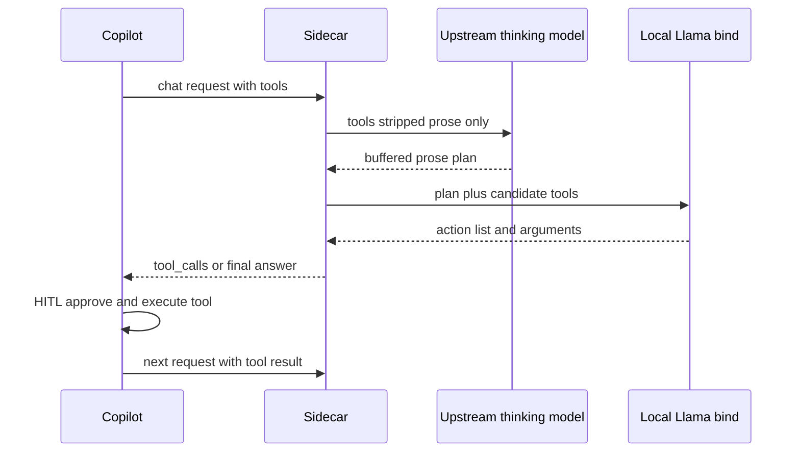

# LLM Sidecar

VS Code extension that runs a local OpenAI-compatible proxy with **bind-and-return tool orchestration**. Use it with Copilot/Cursor BYOK when you want strong upstream reasoning models but need **tool calls to stay local** — the upstream never receives structured tool calls; only prose reasoning crosses the network.

## How it works

1. **Reason phase** — upstream model plans in plain prose only (no tool-call JSON/XML/special blocks; tools stripped from the request; tool results folded into prose context). Upstream reasoning is buffered on-device before anything is shown to the user.
2. **Bind phase** — local llama-server is the **sole determiner** of whether, which, and how to call tools. It emits grammar-constrained JSON action lists and per-tool arguments.
3. **Return to editor** — when tools are needed, intermediate reasoning prose is hidden and only synthesized `tool_calls` are returned; when no tools are needed, the final answer is returned. Copilot executes tools with HITL approval.
4. **Context gathering** — workspace file map, key manifests (`package.json`, `Cargo.toml`, etc.), file-type summary, ripgrep hits, open files, and diagnostics are folded into the reason prompt on-device.

Any request with tools automatically uses this path, regardless of endpoint adapter. Plain chat (no tools) uses the endpoint's configured adapter.



## Quick start

### Contributors

```bash
pnpm install
pnpm run setup:dev      # proxy + llama-server + default model + compile
pnpm run verify:assets
```

Press **F5** to launch the Extension Development Host.

### End users

**Install** from one of:

- [Visual Studio Marketplace](https://marketplace.visualstudio.com/items?itemName=jo-hemphill.llm-sidecar) (VS Code)
- [Open VSX](https://open-vsx.org/extension/jo-hemphill/llm-sidecar) (VSCodium and compatible editors)
- [GitHub Releases](https://github.com/josh-hemphill/vscode-llm-sidecar/releases) VSIX or offline bundle (air-gapped)

**After install**, download runtime assets (not bundled in the VSIX):

1. Run **LLM Sidecar: Download Llama Server** (auto-detects CPU/CUDA/Vulkan/Metal).
2. Run **LLM Sidecar: Download Bind Model** — choose **Llama 3.2 3B** (default) or **Phi-4 mini** (US-compliant catalog only).
3. Run **LLM Sidecar: Add First Endpoint** → choose **Corporate LLM (bind-and-return)**.
4. Set API key, **Sync Language Models**, reload window, pick **LLM Sidecar** in chat.

For air-gapped installs, set `llmSidecar.orchestrator.modelPath` and `llmSidecar.orchestrator.llamaServerBinaryPath`, or use the offline bundle from GitHub Releases.

## Build from source

```bash
pnpm install
pnpm run build          # sidecar-proxy + extension (no model download)
pnpm test
```

Full contributor bootstrap: `pnpm run setup:dev` (see [docs/CONTRIBUTING.md](docs/CONTRIBUTING.md)).

## Settings (highlights)

| Setting | Purpose |
|---------|---------|
| `llmSidecar.orchestrator` | Local bind model (llama.cpp) settings |
| `llmSidecar.endpoints` | Upstream reasoning endpoints; tool requests always use bind-and-return |
| `llmSidecar.orchestrator.selectedModelId` | Local bind model (`llama-3.2-3b-instruct-ud-q4` or `phi-4-mini-instruct-q4`) |
| `llmSidecar.orchestrator.llamaServerVariant` | `auto`, `cpu`, `cuda12`, `cuda13`, `vulkan`, or `metal` |
| `llmSidecar.orchestrator.modelPath` | Explicit GGUF path (air-gapped) |
| `llmSidecar.orchestrator.modelMirrorUrl` | Corporate mirror for model download |
| `llmSidecar.enforceHumanInTheLoop` | Disable YOLO / force per-tool approval |
| `llmSidecar.orchestrator.localOnly` | Block all upstream egress |
| `llmSidecar.orchestrator.ctxSize` | llama-server context for bind (`0` = auto from RAM tier) |
| `llmSidecar.orchestrator.kvCacheType` | KV cache quant: `auto`, `f16`, `q8_0`, `q4_0` (`auto` uses `q4_0` on ≤8GB laptops) |
| `llmSidecar.orchestrator.flashAttention` | Flash attention: `auto`, `on`, `off` (`auto` on Metal/CUDA/Vulkan) |
| `llmSidecar.orchestrator.fitDeviceMemory` | Let llama-server fit layers/ctx to GPU memory (`auto` on ≤16GB RAM) |
| `llmSidecar.orchestrator.fitTargetMib` | IDE headroom (MiB) when fit is enabled (default 1536) |
| `llmSidecar.orchestrator.batchSize` / `ubatchSize` | llama-server batch caps (`0` = auto from RAM tier) |
| `llmSidecar.orchestrator.mlock` | Pin model in RAM (not recommended on ≤8GB unified-memory laptops) |
| `llmSidecar.orchestrator.llamaStartMode` | `onActivate` (default), `onDemand` (first tool call), or `manual` |
| `llmSidecar.orchestrator.llamaIdleTimeoutSec` | Stop owned llama-server after N idle seconds (`0` = disabled; pairs with `onDemand`) |
| `llmSidecar.orchestrator.maxCandidateTools` | Max tools considered per bind turn (default 12; smaller sets improve 3B accuracy) |
| `llmSidecar.orchestrator.maxToolCallsPerTurn` | Max parallel tool calls per turn (default 3; each extra call adds one bind round-trip) |

### Unified-memory laptops (Apple Silicon, iGPU)

VS Code, Copilot, and llama-server share one RAM pool. Defaults auto-tune from `os.totalmem()`:

- **≤8GB:** ctx 4096, KV `q4_0`, smaller batches, `--fit on`, no mlock
- **8–16GB:** ctx 6144, KV `q8_0`, `--fit on`
- **16–24GB:** ctx 8192, KV `q8_0`

For maximum RAM savings, set `llamaStartMode` to `onDemand` and `llamaIdleTimeoutSec` to `300` (5 min). The proxy signals when bind needs llama; the extension starts it on demand and stops it when idle.

On macOS, Metal uses a wired-memory pool (`iogpu.wired_limit_mb`). If llama-server fails with GPU OOM despite free unified RAM, you may need to raise that limit (advanced; see Apple/llama.cpp docs).

**Note:** upstream reasoning is always buffered before bind. When tools are needed, intermediate prose is hidden from the user; final answers appear after upstream + bind complete (not token-streamed live from the upstream model).

## Enterprise HITL policies

Lock tool auto-approval fleet-wide with VS Code enterprise policies:

- `ChatToolsAutoApprove` → `chat.tools.global.autoApprove`
- `ChatToolsEligibleForAutoApproval` → `chat.tools.eligibleForAutoApproval`
- `ChatToolsTerminalEnableAutoApprove` → `chat.tools.terminal.enableAutoApprove`

See [SECURITY.md](SECURITY.md) for audit logging and DLP behavior.

## Packaging note

GGUF models and platform `llama-server` binaries are large. The Marketplace VSIX ships `sidecar-proxy` and the runtime manifest; full binaries ship via **GitHub Releases** or on-demand download commands. US-compliant bind-model catalog: Meta Llama 3.2 3B and Microsoft Phi-4 mini only.

See [docs/PUBLISHING.md](docs/PUBLISHING.md).
